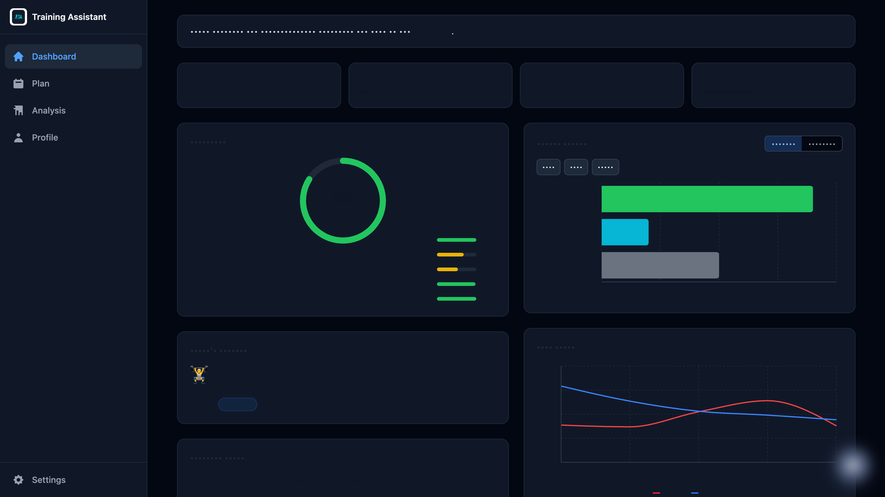
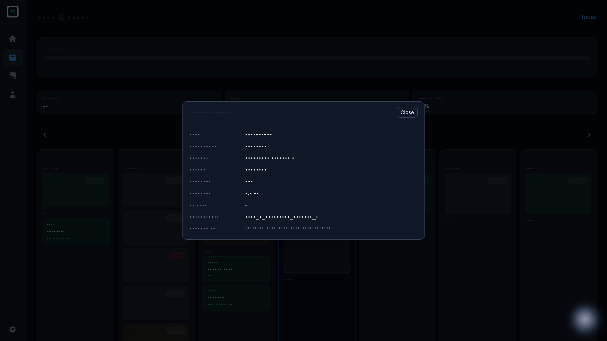
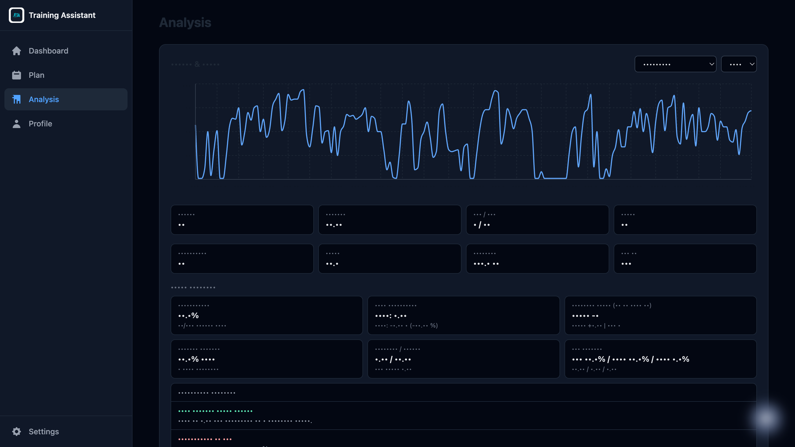

# Training Assistant

## Why I Built This

I built Training Assistant because my real training data lived in multiple places,
and the daily decision was still manual.

I wanted one place that answers:

- How recovered am I today?
- What workout should I actually do today?
- Is my calendar in sync with what Garmin shows on watch/Connect?
- Are my race goals and weekly load moving in the right direction?

This project turns raw metrics into daily coaching context I can act on quickly.

## What It Does For Me

- Pulls daily readiness signals (sleep, HRV, body battery, load) into one dashboard
- Shows plan calendar plus workout detail popovers on each day
- Lets me compare planned vs completed work and spot drift early
- Provides trend analysis and coaching interpretation of the data
- Supports on-demand Garmin refresh when I open/refresh the app

## Why It's Valuable

- Less context switching: one app instead of bouncing between Garmin pages
- Better day-of decisions: readiness + plan + races shown together
- Fewer sync surprises: refresh endpoint helps pull latest Garmin daily data
- More consistency: plan adherence and trend views show what needs attention

## Screenshots

All screenshots below are sanitized/redacted sample views (no personal metrics,
race details, or API secrets).





## Architecture

- `api/`: FastAPI backend with analytics, planning, briefings, and Garmin sync bridges
- `web/`: React + Vite frontend for dashboard, calendar, races, and chat
- `deploy/`: macOS LaunchAgent scripts for local service management

## Requirements

- Python 3.12+
- `uv` (API dependency management)
- Node.js 20+ and npm
- PostgreSQL

## Data Dependency Notes

The API reads Garmin tables that are not fully created by this repo's migrations:

- `garmin_activities`
- `garmin_daily_summary`
- `athlete_biometrics`

These are expected to be populated by the sibling `garmin-connect-sync` workflow
in the same `experiments/` workspace.

If Garmin sync is not configured yet, you can still run the app by disabling
Garmin refresh/writeback in `api/.env` (see `api/.env.example`).

## Quick Start

1. API setup:

```bash
cd api
cp .env.example .env
uv sync --group dev
uv run alembic upgrade head
uv run uvicorn src.main:app --host 0.0.0.0 --port 8000 --reload
```

2. Web setup (new terminal):

```bash
cd web
npm install
npm run dev -- --host 0.0.0.0 --port 4100
```

3. Open `http://127.0.0.1:4100`

The web app proxies `/api` requests to `http://127.0.0.1:8000`.

## Refresh + Garmin Sync

- Dashboard refresh endpoint: `POST /api/v1/dashboard/refresh`
- On-demand refresh pulls latest daily metrics via `garmin-connect-sync`
- Refresh cadence is controlled by `GARMIN_REFRESH_MIN_INTERVAL_SECONDS`

## Privacy and Secrets

- `.env` files are gitignored; use `api/.env.example` as a template
- Do not commit personal API keys or personal workout exports
- Public screenshots in this repo are intentionally redacted

## Development Commands

API smoke tests (DB-light):

```bash
cd api
uv run pytest -q tests/test_health.py tests/test_dashboard_routes.py::test_dashboard_refresh
```

Full API tests (requires populated DB/tables):

```bash
cd api
uv run pytest -q
```

Web production build:

```bash
cd web
npm run build
```

## Local Service Scripts (macOS)

- Restart services: `./deploy/restart_training_assistant.sh`
- Check status: `./deploy/status_training_assistant.sh`

## Contributing

See `CONTRIBUTING.md`.

## License

MIT (`LICENSE`).
